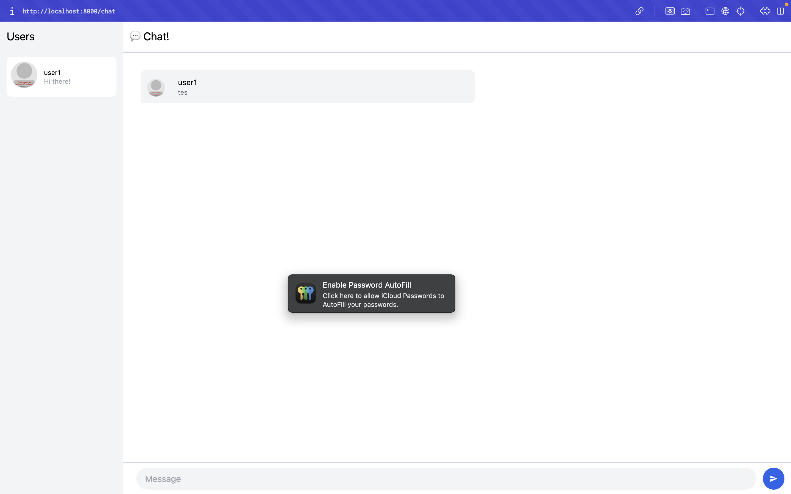
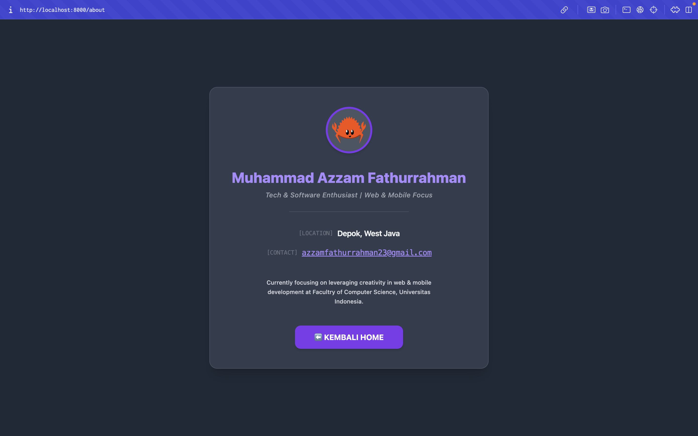

## Experiment 3.2: Be Creative!

### Penjelasan 
Pada eksperimen ini, saya berkreasi dengan membuat halaman profil baru (`/about`) yang berfungsi sebagai kartu nama digital. Halaman ini dibangun menggunakan komponen `About` yang didaftarkan pada sistem `yew-router` dan dirancang dengan Tailwind CSS agar layarnya *full-width* serta konsisten dengan tema gelap pada halaman utama. Untuk kontennya, saya menampilkan informasi profesional yang *clean* dan *to-the-point*, mencakup nama lengkap, ketertarikan pada *web & mobile development*, kontak email, serta maskot Rust (Ferris). Terakhir, saya memodifikasi halaman Login dengan menambahkan komponen `<Link>` sebagai tombol navigasi agar pengguna dapat berpindah ke halaman profil ini secara instan tanpa me-*reload* *browser*, memaksimalkan keunggulan Yew sebagai *Single Page Application* (SPA).

## Bonus: Rust Websocket server for YewChat!

### Gimana cara ngerjainnya?
Di Tutorial 2, server Rust kita cuma ngirim teks biasa yang ditambahin `"IP:Port: "`. Nah, masalahnya *frontend* YewChat ini lumayan ketat dan wajib nerima pesan dalam format JSON. Biar server Rust bisa nyambung ke YewChat, ini yang aku lakuin:
1. Nambahin *library* `serde_json` di `Cargo.toml` biar Rust bisa baca dan bikin JSON.
2. Bikin tempat nyimpen data (pakai `Arc<Mutex<HashSet<String>>>`) buat ngelacak siapa aja *user* yang lagi *online*.
3. Nyamain format JSON-nya. YewChat pakai format *camelCase* (contoh: `messageType` dan `dataArray`), jadi kodingan server Rust juga harus ngikutin format itu.
4. Ngebenerin cara ngirim pesan *chat*. YewChat ternyata minta isi pesan dibungkus lagi jadi *string* JSON di dalam *key* `"data"`. Jadi, server Rust harus merakit data pesannya dulu, ngubahnya jadi teks, baru dikirim ke *frontend*.

### Kenapa perubahannya bisa sukses?
Intinya, WebSocket itu cuma sekadar kurir pengantar teks. Selama teks yang dikirim oleh server Rust bentuknya JSON dan susunannya 100% cocok sama apa yang diharapkan oleh YewChat, aplikasinya bakal tetap jalan mulus seolah-olah kita masih pakai server Node.js bawaannya.

### Pilih Javascript (Node.js) atau Rust?
Jujur, aku lebih condong milih **Rust**. Node.js memang lebih santai dan gampang banget buat ngotak-ngatik JSON. Tapi, Rust ngasih keamanan (*Type Safety*) dan performa yang jauh lebih mantap. Apalagi dengan *library* Tokio, server Rust bisa nanganin banyak banget koneksi yang masuk barengan secara efisien tanpa takut servernya antre atau *nge-hang*, beda dengan Javascript yang cuma *single-threaded*.